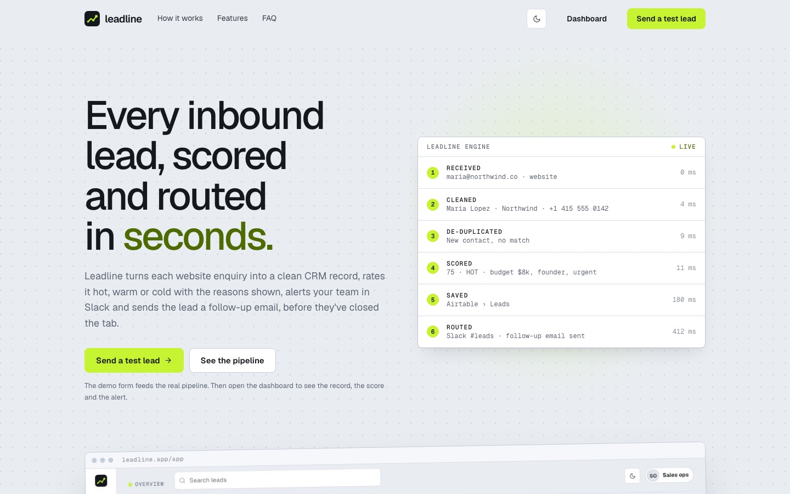
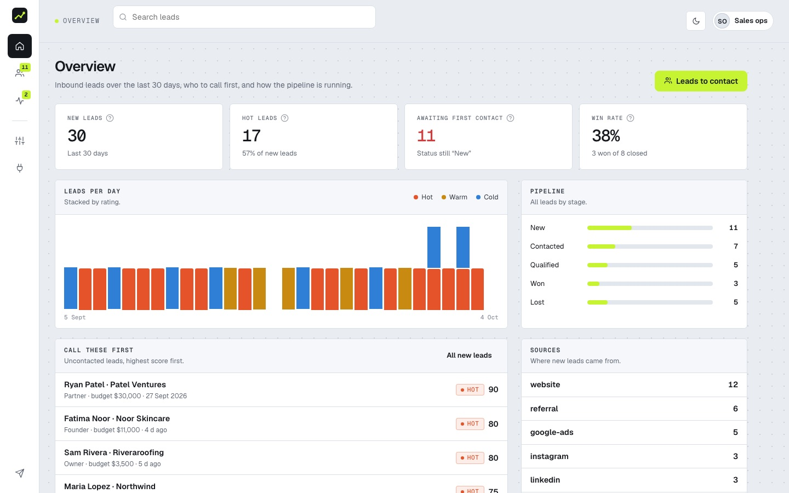
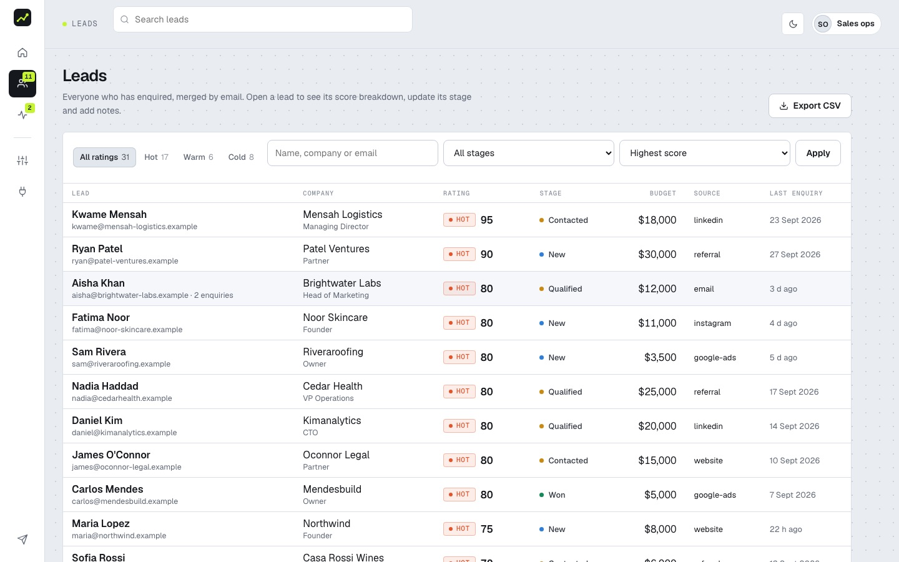
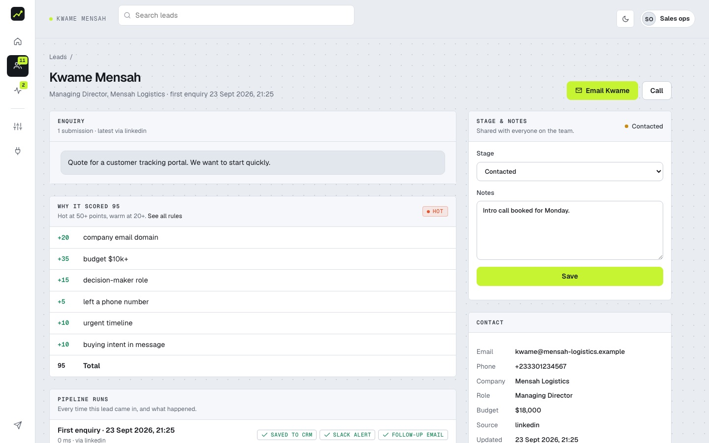
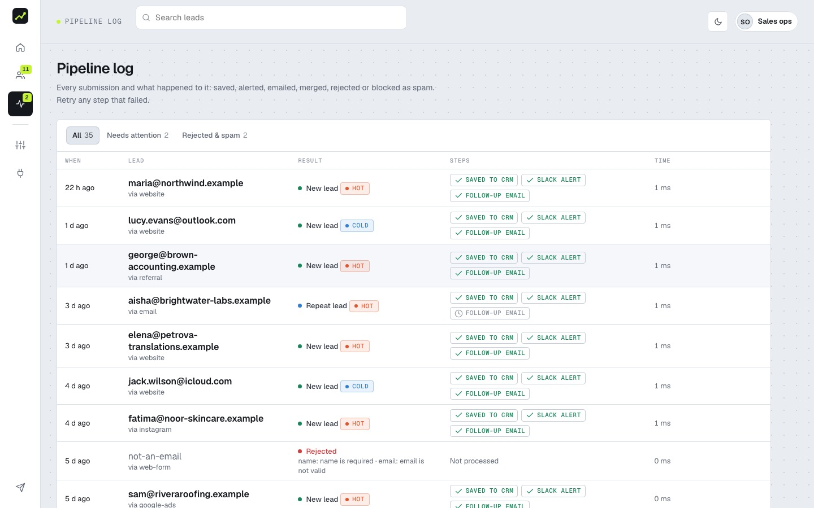
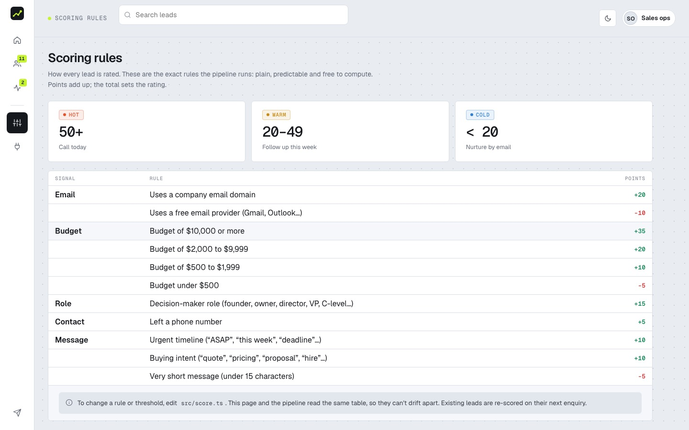
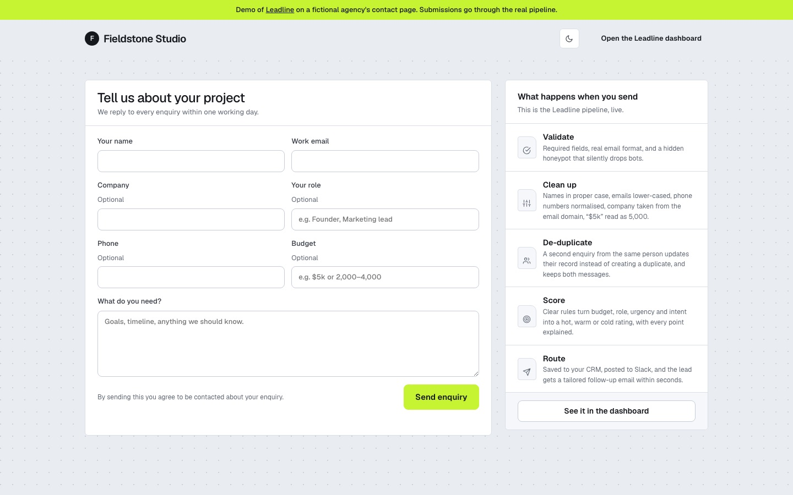

# Leadline: every inbound lead, cleaned, scored and routed in seconds

Leadline turns each website enquiry into a clean, de-duplicated CRM record, rates it **hot, warm or cold with the
reasons shown**, alerts the team in Slack and sends the lead a follow-up email. It then gives the sales team a
dashboard to work the pipeline.



**Built by [Sydney Torkornoo](https://baobabpeaks.com)**, full-stack and automation developer · [GitHub](https://github.com/sydneyKojo)

---

## The problem it solves

The first hour decides most deals. Enquiries sit in a shared inbox, get copied into the CRM by hand with duplicates and
typos, and nobody knows which one to call first. Leadline fixes that automatically:

- **In the CRM and in Slack within seconds** of the form being sent.
- **Clean data:** names properly capitalised, emails lower-cased, phone numbers normalised, company taken from the
  email domain, "$5k" read as 5,000.
- **No duplicates:** repeat enquiries merge into one record with every message kept.
- **Know who to call first:** transparent scoring rules with every point explained.
- **Nothing gets lost:** the lead is always saved first; if Slack or email fails, the failure is logged and can be
  retried with one click.

**Who it's for:** sales and operations teams at agencies and service businesses that live on inbound enquiries.

## Screenshots

| Dashboard | Leads |
|---|---|
|  |  |
| **Lead detail: why it scored 95** | **Pipeline log with retry** |
|  |  |
| **Scoring rules (rendered from code)** | **Demo contact form** |
|  |  |

## The pipeline

```
Form / Typeform / Webflow / n8n ──► POST /webhook/lead (secret header)   or   /form (same-site demo form, rate limited)
  1. validate      required fields, real email; a hidden honeypot silently drops bots
  2. clean up      name casing, email, phone to +digits, company from domain, budget text to a number
  3. de-duplicate  same email → merge into one record, keep every message, count enquiries
  4. score         rule table (src/score.ts): email type, budget, role, urgency, buying intent → hot / warm / cold
  5. save          PostgreSQL, Airtable or a local file (always first, so a lead is never lost)
  6. route         Slack alert + tailored follow-up email; each step's result is logged per run
```

## Features

### Sales dashboard (`/app`)
- **Overview:** new leads, hot leads, awaiting first contact, win rate, leads per day by rating, pipeline by stage,
  "call these first", lead sources, average processing time.
- **Leads:** filter by rating and stage, search, sort by score or recency, CSV export.
- **Lead detail:** every enquiry, the score breakdown point by point, stage (*New → Contacted → Qualified → Won/Lost*),
  shared notes, and the history of pipeline runs for that lead.
- **Pipeline log:** every submission with the result of each step (saved, Slack, email), rejected and spam runs,
  and **retry for failed steps** (only the failed steps are re-sent).
- **Scoring rules:** rendered from the same table the pipeline runs, so the page and the logic can't drift apart.
- **Integrations:** CRM, Slack and email status, webhook URL and a copyable example, n8n workflow download.

### No-code version
`n8n/lead-to-crm.workflow.json` is the same flow as an importable n8n workflow: Webhook → clean and score (Code node)
→ Google Sheets upsert by email → Slack → Gmail. It is generated from `n8n/normalise-and-score.js` by
`node n8n/build-workflow.mjs`, so its rules match the code version.

## Engineering notes

- Constant-time secret checks for the webhook; signed, expiring httpOnly sessions for the dashboard.
- The public form accepts same-site posts only, is rate limited per visitor, and answers bots exactly as it answers
  people, so they can't tell they were blocked.
- File-store writes are queued and atomic (write then rename), so concurrent submissions can't corrupt data.
- The store is an interface (`findByEmail`, `findById`, `list`, `insert`, `update`), so HubSpot, Pipedrive or Postgres is
  one small class away.
- CSV exports neutralise spreadsheet formulas while keeping phone numbers intact.

## Tech stack

TypeScript · Node.js · Hono (server-rendered JSX) · PostgreSQL · Zod · Vitest · Airtable API · Slack webhooks · Resend · n8n ·
Google Sheets · Gmail · hand-written CSS (Geist and Geist Mono, light and dark themes).

## Run it locally

Requires Node 22+ and, for the Postgres store, PostgreSQL.

```bash
npm install
cp .env.example .env        # set WEBHOOK_SECRET and ADMIN_TOKEN; STORE=postgres + DATABASE_URL, or STORE=file
createdb leadline && createdb leadline_test
npm run seed                # a month of example enquiries, sent through the real pipeline
npm run dev                 # http://localhost:3200 · demo form: /demo · dashboard: /app
npm test                    # 29 tests: parsing, scoring, de-duplication, spam, rate limits, retry, auth, CSV, Postgres
```

Send a lead from any tool:

```bash
curl -X POST localhost:3200/webhook/lead \
  -H "X-Webhook-Secret: $WEBHOOK_SECRET" -H "Content-Type: application/json" \
  -d '{"name":"maria lopez","email":"Maria@Northwind.co","role":"Founder","budget":"$8k","message":"Need a quote asap"}'
```

## Project structure

```
src/lead.ts        validation and normalisation
src/score.ts       the scoring rule table
src/pipeline.ts    process a lead end to end; retry failed steps
src/store.ts       file, memory and Airtable stores
src/pg.ts          PostgreSQL store and run log
src/runs.ts        the pipeline run log
src/app.tsx        routes: public site, webhook, dashboard
src/views/         server-rendered pages
n8n/               the no-code workflow and its generator
```

## Deployment notes

Runs as one Node service (Railway, Render or Fly.io). Set `STORE=postgres` and `DATABASE_URL`; it can share a
Postgres server with other apps by using its own database (e.g. `/leadline`). Tables are created on start. Connect Slack (`SLACK_WEBHOOK_URL`) and Resend (`RESEND_API_KEY`) to send real alerts and emails.

---

Demo people and companies are fictional.

© 2026 Sydney Torkornoo. All rights reserved. This code is published for portfolio review; it is not licensed for
reuse. For work enquiries, visit [baobabpeaks.com](https://baobabpeaks.com).
